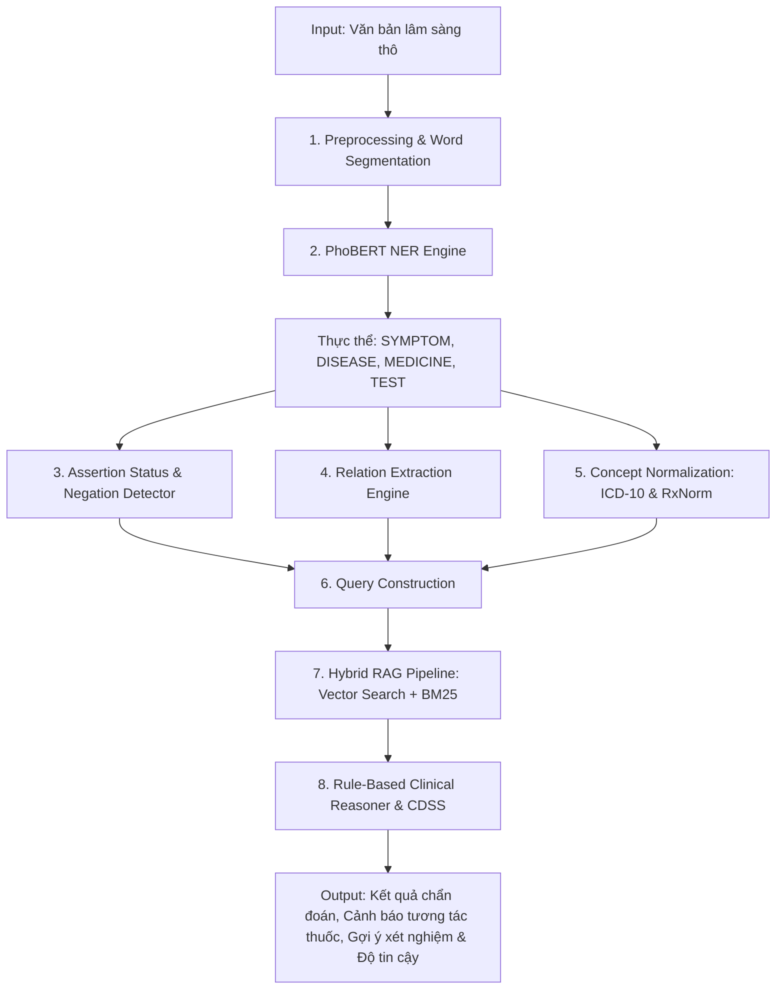

# Hướng Giải Quyết Các Bài Toán Từ Input Của Model - Medical AI Agent

Tài liệu này mô tả chi tiết kiến trúc, luồng xử lý dữ liệu và phương pháp giải quyết từng bài toán cụ thể từ **văn bản đầu vào (Input)** trong hệ thống **Medical AI Agent for Vietnamese Clinical NLP**.

---

## 1. Tổng Quan Kiến Trúc Xử Lý Input (Input Processing Architecture)

Hệ thống tiếp nhận đầu vào thô dưới dạng văn bản lâm sàng tiếng Việt tự do (unstructured clinical text) và các thông tin ngữ cảnh phụ phụ (session ID, patient ID). Qua pipeline đa tầng, dữ liệu được chuyển hóa từ **văn bản thô (Raw Text) → Thực thể được cấu trúc hóa (Structured Entities) → Tri thức y khoa mở rộng (RAG Context) → Quyết định hỗ trợ lâm sàng (Clinical Decisions)**.



---

## 2. Chi Tiết Phương Pháp Giải Quyết Theo Từng Bài Toán

### Bài toán 1: Nhận diện Thực thể Y tế (Named Entity Recognition - NER)

* **Thách thức:** Văn bản y tế tiếng Việt có đặc thù từ ghép, từ viết tắt, cấu trúc câu phức tạp và không tuân theo quy chuẩn cố định.
* **Input:** Chuỗi văn bản thô (ví dụ: *"Bệnh nhân sốt cao 39 độ kèm ho khan, nghi ngờ sốt xuất huyết, kê Paracetamol."*).
* **Phương pháp giải quyết:**
  1. **Tách từ tiếng Việt (Word Segmentation):** Sử dụng thư viện `underthesea` để ghép các từ phức thành dạng gạch dưới (VD: *"sốt cao"* $\rightarrow$ `"sốt_cao"`, *"sốt xuất huyết"* $\rightarrow$ `"sốt_xuất_huyết"`).
  2. **Mã hóa Subword & Lập bản đồ Offset (Subword Tokenization):** Sử dụng `PhoBERT Tokenizer` (`vinai/phobert-base`). Duy trì danh sách `offset_mapping` và `word_ids` để theo dõi vị trí chính xác của từng subword so với chuỗi văn bản gốc.
  3. **Gán nhãn Chuỗi BIO (Sequence Tagging):** Đưa qua mô hình `PhoBERT-NER` (đã được fine-tune trên dữ liệu lâm sàng tiếng Việt) để dự đoán nhãn BIO cho 4 nhóm thực thể:
     * `SYMPTOM`: Triệu chứng lâm sàng (VD: *sốt cao, ho khan, đau đầu*).
     * `DISEASE`: Bệnh lý, chẩn đoán (VD: *sốt xuất huyết, viêm phổi, tiểu đường*).
     * `MEDICINE`: Thuốc, dược chất, hàm lượng (VD: *Paracetamol, Hapacol 500mg*).
     * `TEST`: Chỉ định cận lâm sàng, xét nghiệm (VD: *Chụp X-quang phổi, Công thức máu*).
  4. **Post-processing & Span Alignment:** Khôi phục vị trí bắt đầu (`start`) và kết thúc (`end`) của thực thể trên chuỗi văn bản ban đầu, kèm điểm số tin cậy (`score`).

---

### Bài toán 2: Phân loại Trạng thái Thực thể & Phủ định (Assertion Status & Negation Detection)

* **Thách thức:** Nếu chỉ nhận diện thực thể mà không xét ngữ cảnh phủ định hoặc tiền sử, mô hình sẽ hiểu nhầm triệu chứng/bệnh lý không có thực thành bệnh nhân đang mắc.
  * Ví dụ: *"Bệnh nhân **không sốt**, **chưa từng mắc** tiểu đường, **gia đình có tiền sử** ung thư."*
* **Input:** Văn bản gốc + Danh sách thực thể trích xuất từ Bài toán 1.
* **Phương pháp giải quyết:**
  * Module `AssertionDetector` kết hợp phân tích cây cú pháp (Dependency Parsing) và quy tắc ngữ nghĩa (Pattern Rules) để gán nhãn trạng thái cho từng thực thể:
    * `PRESENT`: Đang hiện hữu / Đang mắc (mặc định).
    * `ABSENT` / `NEGATED`: Phủ định (*không có, không phát hiện, chưa thấy*).
    * `POSSIBLE` / `UNCERTAIN`: Nghi ngờ, chưa chắc chắn (*nghi ngờ, theo dõi, có thể*).
    * `HYPOTHETICAL`: Giả định (*nếu sốt lại thì uống...*).
    * `FAMILY_HISTORY`: Tiền sử gia đình (*bố mắc tiểu đường*).

---

### Bài toán 3: Trích xuất Mối quan hệ giữa các Thực thể (Relation Extraction - RE)

* **Thách thức:** Xác định sự liên kết logic giữa các thực thể xuất hiện trong cùng văn bản.
* **Input:** Danh sách thực thể đã trích xuất + Ngữ cảnh câu văn.
* **Phương pháp giải quyết:**
  * Module `RelationDetector` xác định các liên kết ngữ nghĩa giữa các cặp thực thể:
    * `TREATS`: Thuốc $\rightarrow$ Bệnh lý (VD: *Paracetamol* điều trị *Sốt*).
    * `CAUSES_SYMPTOM`: Bệnh lý $\rightarrow$ Triệu chứng (VD: *Sốt xuất huyết* gây *Sốt cao*).
    * `DIAGNOSES`: Xét nghiệm $\rightarrow$ Bệnh lý (VD: *Chụp X-quang* chẩn đoán *Viêm phổi*).
    * `HAS_DOSAGE`: Thuốc $\rightarrow$ Liều dùng/Cách dùng.
  * Xây dựng đồ thị quan hệ nội tại (Relation Graph) làm tiền đề cho bước suy luận lâm sàng.

---

### Bài toán 4: Chuẩn hóa Thực thể sang Mã danh mục Y tế (Concept Normalization)

* **Thách thức:** Tên gọi thực thể tự do có nhiều từ đồng nghĩa, từ lóng hoặc từ địa phương (VD: *"nhức đầu"* = *"đau đầu"*; *"Paracetamol"* = *"Hapacol"*).
* **Input:** Tên thực thể thô và loại thực thể (`SYMPTOM`, `DISEASE`, `MEDICINE`).
* **Phương pháp giải quyết:**
  1. **Chuẩn hóa ICD-10 (Dành cho `SYMPTOM` & `DISEASE`):** `ICD10Service` sử dụng thuật toán so khớp chuỗi mờ (Fuzzy String Matching) kết hợp Vector Semantic Embedding để ánh xạ thuật ngữ sang mã quốc tế ICD-10 (Ví dụ: *"Đau đầu"* $\rightarrow$ `R51`, *"Sốt xuất huyết"* $\rightarrow$ `A91`).
  2. **Chuẩn hóa RxNorm (Dành cho `MEDICINE`):** `RxNormService` ánh xạ biệt dược/tên thuốc thương mại về tên hoạt chất gốc GSN/RxNorm CUI (Ví dụ: *"Hapacol 500mg"* $\rightarrow$ `Paracetamol`).

---

### Bài toán 5: Truy vấn Tri thức Y khoa Augmentation (RAG Pipeline)

* **Thách thức:** Tránh hiện tượng mô hình AI tạo ra thông tin giả mạo (Hallucination), đảm bảo các gợi ý dựa trên tài liệu y khoa chính thống (Phác đồ Bộ Y tế, Dược thư).
* **Input:** Văn bản gốc + Các từ khóa & Mã ICD-10/RxNorm đã chuẩn hóa.
* **Phương pháp giải quyết:**
  1. **Xây dựng Query tìm kiếm:** Tự động tổng hợp query phong phú từ câu văn và mã thực thể chuẩn hóa: `build_retrieval_query(text, normalized_entities)`.
  2. **Tìm kiếm lai (Hybrid Search):**
     * **Dense Search:** Sử dụng Embedding model (`SentenceTransformers` / `PhoBERT Embedding`) truy vấn Vector Database (ChromaDB / FAISS) để tìm theo ngữ nghĩa.
     * **Sparse Search:** Sử dụng thuật toán `BM25` để tìm chính xác thuật ngữ y học đặc thù.
  3. **Xếp hạng lại (Reranking):** Lọc và lấy Top-K đoạn văn tri thức có điểm liên quan cao nhất phục vụ bước suy luận.

---

### Bài toán 6: Suy luận Lâm sàng & Hỗ trợ Quyết định (Clinical Decision Support System - CDSS)

* **Thách thức:** Tổng hợp toàn bộ dữ liệu (NER + Assertion + Relations + Normalized Concepts + RAG Knowledge) để đưa ra phản hồi có giá trị y khoa cho bác sĩ.
* **Input:** Kết quả của tất cả các bước trên + Lịch sử hội thoại (Conversation Memory) & Sinh hiệu (Vital signs nếu có).
* **Phương pháp giải quyết:**
  * Engine `RuleBasedClinicalReasoner` & `DecisionEngine` thực hiện các công việc:
    1. **Cảnh báo Tương tác Thuốc (Drug-Drug Interaction - DDI):** Kiểm tra xem trong các thuốc phát hiện được hoặc thuốc bệnh nhân đang dùng có cặp nào xung đột, gây tác dụng phụ nguy hiểm không.
    2. **Gợi ý Chẩn đoán Vi phân (Differential Diagnosis):** Tính điểm khớp giữa triệu chứng của bệnh nhân với các bệnh lý khả dĩ dựa trên tri thức RAG và Knowledge Graph.
    3. **Gợi ý Xét nghiệm & Cận lâm sàng (Test Recommendation):** Đề xuất bác sĩ cho làm thêm các xét nghiệm cần thiết nếu các triệu chứng hiện tại chưa đủ căn cứ chẩn đoán.
    4. **Đánh giá Mức độ Rủi ro (Risk Stratification):** Phân loại nguy cơ bệnh nhân (Nhẹ / Trung bình / Nặng / Cấp cứu) khi xuất hiện các triệu chứng cảnh báo đỏ (Red Flags).

---

### Bài toán 7: Đánh giá Hiệu năng, Độ tin cậy & Giám sát (MLOps & Explainability)

* **Thách thức:** Đo lường độ trễ (latency), mức độ sử dụng phần cứng GPU/RAM và giải thích lý do mô hình đưa ra kết quả.
* **Input:** Metadata của quá trình thực thi pipeline.
* **Phương pháp giải quyết:**
  1. **Latency Breakdown:** Ghi nhận và theo dõi thời gian xử lý từng công đoạn (`ner_ms`, `retriever_ms`, `reasoner_ms`, `total_ms`).
  2. **GPU & Memory Monitoring:** Tự động giám sát lượng VRAM allocated/reserved trên thiết bị CUDA.
  3. **Confidence Scoring:** Tính điểm tự tin tổng hợp từ độ tin cậy của NER, RAG matching score và rule validation.
  4. **Logging & Tracing:** Đưa log xoay vòng (Rotating File Logs) vào thư mục `logs/` để phục vụ audit và giám sát MLOps.

---

## 3. Cấu Trúc Output Trả Về (Final Model Output Schema)

Khi người dùng gửi input qua CLI hoặc REST API (`POST /predict`), hệ thống trả về cấu trúc JSON chuẩn hóa như sau:

```json
{
  "text": "Bệnh nhân sốt cao kèm ho khan, chẩn đoán mắc sốt xuất huyết và uống Paracetamol.",
  "entities": [
    {
      "text": "sốt cao",
      "type": "SYMPTOM",
      "score": 0.9854,
      "start": 10,
      "end": 17
    },
    {
      "text": "sốt xuất huyết",
      "type": "DISEASE",
      "score": 0.9912,
      "start": 44,
      "end": 58
    },
    {
      "text": "Paracetamol",
      "type": "MEDICINE",
      "score": 0.9985,
      "start": 67,
      "end": 78
    }
  ],
  "normalized_entities": [
    {
      "original": "sốt cao",
      "type": "SYMPTOM",
      "code_system": "ICD-10",
      "code": "R50.9",
      "name": "Fever, unspecified"
    },
    {
      "original": "sốt xuất huyết",
      "type": "DISEASE",
      "code_system": "ICD-10",
      "code": "A91",
      "name": "Dengue haemorrhagic fever"
    },
    {
      "original": "Paracetamol",
      "type": "MEDICINE",
      "code_system": "RxNorm",
      "code": "161",
      "name": "Acetaminophen / Paracetamol"
    }
  ],
  "knowledge": [
    {
      "source": "Bộ Y tế - Hướng dẫn chẩn đoán Sốt xuất huyết",
      "content": "Theo dõi tiểu cầu, bù dịch bằng oresol, dùng Paracetamol hạ sốt khi sốt > 38.5 độ..."
    }
  ],
  "clinical_reasoning": {
    "summary": "Bệnh nhân có triệu chứng sốt cao, chẩn đoán phù hợp với Sốt xuất huyết Dengue.",
    "warnings": [],
    "recommended_tests": ["Công thức máu (HCT, Tiểu cầu)", "Test nhanh Dengue NS1"],
    "confidence": 0.965
  },
  "processing_time": {
    "ner_ms": 15.2,
    "retriever_ms": 22.4,
    "reasoner_ms": 8.1,
    "total_ms": 45.7
  },
  "gpu_usage": {
    "available": true,
    "device": "NVIDIA GeForce RTX 4060",
    "memory_allocated_mb": 412.5,
    "memory_reserved_mb": 1024.0
  }
}
```

---

## 4. Tổng Kết

Kiến trúc giải quyết bài toán từ Input của **Medical AI Agent** tuân thủ nguyên tắc:
1. **Độ chính xác cao & An toàn y tế (Safety First):** Không chỉ dừng lại ở trích xuất từ ngữ mà còn đánh giá phủ định, chuẩn hóa danh mục ICD-10/RxNorm và đối soát tri thức qua RAG.
2. **Khả năng mở rộng (Modular Architecture):** Mỗi bài toán (NER, Assertion, Relation, RAG, CDSS) là một module độc lập, dễ dàng nâng cấp hoặc thay thế model (PhoBERT, ViT, LLM).
3. **Sẵn sàng triển khai thực tế (Production Ready):** Tích hợp đo độ trễ, theo dõi GPU, logging xoay vòng và REST API FastAPI.
